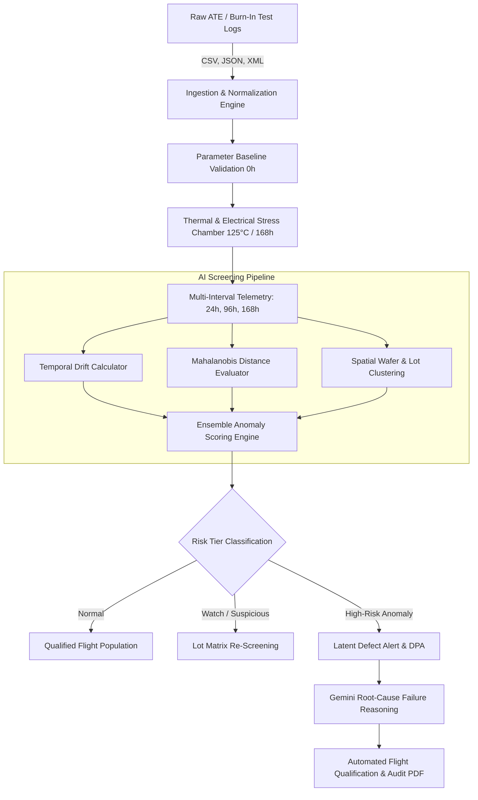

# BurnIn AI — Intelligent Component Stress Screening & Anomaly Detection

> **Aerospace & Defense Electronics Qualification Platform**  
> *Addressing Problem Statement 26170: AI-Driven Anomaly Detection in Component Burn-In & Stress Screening Beyond Conventional Static Limits.*

---

## 📌 Executive Summary

High-reliability electronic components destined for space missions, satellite payloads, and aerospace launch vehicles must undergo extensive **Burn-In Screening** (typically 168 hours of accelerated thermal and electrical stress at 125°C). 

Under conventional military and aerospace screening standards (e.g., MIL-STD-883, MIL-PRF-38535), components are evaluated purely against **static threshold limits** (e.g., *Leakage Current $I_{leak} < 50\,\mu\text{A}$*).

### The Latent Defect Dilemma
A component with a subtle manufacturing anomaly (such as a localized gate-oxide thinning, micro-void in metal interconnects, or mobile ionic contamination) often starts at a nominal baseline ($10.2\,\mu\text{A}$) and drifts aggressively during stress to $44.6\,\mu\text{A}$. 

Because $44.6\,\mu\text{A} < 50.0\,\mu\text{A}$, **conventional screening marks this component as "PASS"**. In orbital flight, however, this component continues its non-linear degradation trajectory, resulting in catastrophic mission failure.

**BurnIn AI** solves this critical vulnerability by combining **multivariate machine learning**, **temporal slope trajectory analysis ($\Delta P / \Delta t$)**, **spatial wafer lot variance tracking**, and **LLM-assisted physical failure analysis** to identify latent anomalies long before hard threshold violations occur.

---

## 🔬 Technical Approach & Mathematical Framework

### 1. Temporal Drift Rate & Non-Linear Slope Analysis
Rather than evaluating instantaneous values $P(t)$, the system computes the first and second derivatives of electrical parameters over discrete burn-in checkpoints ($t \in \{0\text{h}, 24\text{h}, 96\text{h}, 168\text{h}\}$):

$$\text{Drift Rate } (\%) = \left( \frac{P_{168\text{h}} - P_{0\text{h}}}{P_{0\text{h}}} \right) \times 100$$

$$\text{Acceleration Index } (\alpha) = \frac{\Delta P_{96\text{h} \to 168\text{h}}}{\Delta P_{0\text{h} \to 24\text{h}}}$$

Components exhibiting $\alpha > 2.5$ or exponential growth patterns $P(t) \propto e^{\lambda t}$ are flagged for latent dielectric breakdown risks.

### 2. Multi-Parametric Anomaly Scoring
The platform evaluates multi-dimensional parameter vectors for each component:
$$\mathbf{X}_i = \left[ I_{leak}, I_{DDQ}, t_{pd}, V_{th}, R_{ON}, \Delta I_{leak}, \Delta I_{DDQ}, \Delta t_{pd} \right]^T$$

- **Mahalanobis Distance ($D_M$)**: Evaluates component divergence from the lot covariance matrix $\mathbf{\Sigma}$:
  $$D_M(\mathbf{X}_i) = \sqrt{(\mathbf{X}_i - \boldsymbol{\mu})^T \mathbf{\Sigma}^{-1} (\mathbf{X}_i - \boldsymbol{\mu})}$$
- **Isolation Forest & Ensemble Scores**: Partitions feature spaces to isolate out-of-distribution outliers without assuming normal distribution.
- **Composite Anomaly Score ($S_{anomaly}$)**: Normalized from $0$ to $100$:
  $$S_{anomaly} = w_1 \cdot \text{Norm}(D_M) + w_2 \cdot \text{Drift}_{\%} + w_3 \cdot \alpha + w_4 \cdot S_{lot\_zscore}$$

### 3. Risk Stratification Tiers

| Classification | Score Threshold | Drift Characteristic | Action Protocol |
| :--- | :--- | :--- | :--- |
| **NORMAL (PASS)** | $S < 40$ | Nominal variance within lot mean ($\pm 5\%$) | Approved for Flight Assembly |
| **WATCH** | $40 \le S < 70$ | Minor drift ($10\% - 40\%$), uniform slope | Secondary Test Correlation |
| **SUSPICIOUS** | $70 \le S < 85$ | Significant drift ($40\% - 150\%$), diverging | Quarantined; Destructive Physical Analysis (DPA) Candidate |
| **HIGH-RISK (ANOMALY)** | $S \ge 85$ | Exponential drift ($> 150\%$), non-linear acceleration | **Flight Rejection**; Root Cause Failure Analysis |

---

## 🚀 End-to-End Workflow



1. **Data Ingestion**: Ingests automated test equipment (ATE) data across multi-hour stress steps ($0\text{h} \to 24\text{h} \to 96\text{h} \to 168\text{h}$).
2. **Preprocessing & Baseline Alignment**: Normalizes parameter shifts against reference standards and ambient chamber offsets.
3. **AI Anomaly Detection Pipeline**: Calculates multivariate distance metrics, temporal drift velocity, and wafer spatial clustering.
4. **Lot & Wafer Intelligence**: Identifies systemic fabrication lot anomalies versus isolated single-die latent flaws.
5. **Interactive Failure Analysis & LLM Diagnosis**: Real-time physical root-cause diagnosis powered by Gemini with physics-of-failure reasoning (e.g., Time-Dependent Dielectric Breakdown, Electromigration, Hot Carrier Injection).
6. **Qualification Reporting**: Generates MIL-STD compliant aerospace audit reports with downloadable summaries and interactive visual charts.

---

## 📊 Application Modules & Core Capabilities

- **Command-Center Dashboard**: Executive telemetry, total component risk distribution, parameter drift multi-line graphs, and latent defect alerts.
- **Anomaly Detection & Ranking Queue**: High-performance searchable and filterable queue with real-time score indicators, lot filtering, and sorting.
- **Component Deep Dive (e.g., C-1045 Analysis)**: Deep parametric breakdown showing 0h–168h trajectories, radar charts, comparative lot distributions, and physical failure modes.
- **Lot & Wafer Matrix Analysis**: Lot-to-lot yield comparison, wafer radial spatial defect mapping, and batch reliability indexes.
- **Multi-Parameter Scatter & Correlation Analytics**: Scatter plotting (e.g., Initial $I_{leak}$ vs Drift Rate) illustrating static pass envelopes vs. AI anomaly boundaries.
- **Static vs. AI Screening Comparison**: Interactive comparative drilldown showcasing false-negative prevention metrics.
- **AI Model Performance & Benchmarks**: Precision, recall, ROC-AUC curves, and confusion matrix benchmarking traditional thresholding vs. AI ensemble models.
- **Data Ingestion Portal**: Drag-and-drop file ingestion supporting ATE CSV/JSON test logs with schema validation.
- **Aerospace Audit & PDF Export**: One-click flight qualification certification report generator.

---

## 🛠️ Technology Stack

- **Frontend**: React 18, TypeScript, Tailwind CSS, Recharts, Lucide React, Motion
- **Backend**: Node.js, Express, TypeScript, tsx / esbuild
- **AI / Reasoning**: Google Gen AI SDK (`@google/genai`), Physics-of-Failure Prompt Chains
- **Build / Packaging**: Vite, ES Module / CommonJS hybrid compilation for Cloud Run containerization

---

## 💻 Local Development & Deployment

### 1. Prerequisites
- Node.js 18+ or 20+
- npm / bun

### 2. Installation
```bash
# Clone the repository
git clone <repository-url>
cd burnin-ai

# Install dependencies
npm install
```

### 3. Environment Configuration
Create a `.env` file based on `.env.example`:
```env
GEMINI_API_KEY=your_gemini_api_key_here
```

### 4. Running the Development Server
```bash
# Starts both the Express backend API and Vite middleware on port 3000
npm run dev
```

Open `http://localhost:3000` in your browser.

### 5. Production Build & Start
```bash
# Builds client assets with Vite and bundles server.ts into dist/server.cjs
npm run build

# Starts the production CommonJS server
npm start
```

---

## 📜 Compliance & Standards Reference

- **ISRO Problem Statement 26170**: AI-Driven Anomaly Detection in Component Burn-In & Screening
- **MIL-STD-883**: Test Method Standard for Microcircuits (Method 1015 - Burn-In Screening)
- **MIL-PRF-38535**: Integrated Circuits (Microcircuits) Manufacturing General Specification
- **AEC-Q100**: Stress Test Qualification for Automotive / Aerospace Grade Integrated Circuits
